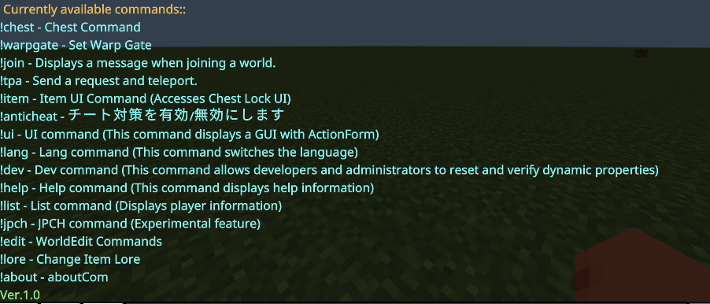

## Japanese Readme

[Click here for Japanese 👈](README.md)

## Download⬇️

[Download Here👈](https://github.com/gamelist1990/ChestLockAddon/releases)

## Update

**Version 1.1** Updated to support Minecraft Version 1.21.30
[ChangeLog](https://github.com/gamelist1990/ChestLockAddon/compare/1.0...1.1)

**Changes:**
For detailed changes, please refer to the ChangeLog above☝

Here is a brief summary of the changes:

- This update brings compatibility with Minecraft Version 1.21.30.
- Includes various bug fixes.
- Introduces a new feature: Staff command.
- Added a report command.

## Overview

This addon is operated by executing commands such as `!help`. It supports UI elements, use `!item` or `!ui` to access them. The prefix `!` can be changed in `handler.ts`. The addon is also multilingual. 

If you encounter any bugs or issues, feel free to contact me on Discord or through Issues.

## Commands

* All owner commands require the (OP) tag, so please use `/tag @s add op`.
* **`!help`**: Displays a list of available commands.
* **`!chest`**: Opens the chest command menu.
* **`!lang`**: Changes the language setting.
* **`!dev`**: Developer command (op required).
* **`!ui`**: Added a UI command for PS4/5.
* **`!jpch`**: An experimental feature replicating LunaChat.
* **`!item`**: Obtain an item that opens the UI.
* **`!tpa`**: Send a teleport request.
* **`!list`**: Displays player information (op required).
* **`!antichat`**: Use with on|off|freeze Player |unfreeze Player (op required).
* **`!lore`**:  `!lore -set apple` sets the description of the item in hand.  `!lore -rename test` renames the item in hand.
* **`!join`**:  Use this command with subcommand -settings to set rules. Toggle display with (-true/-false) (op required).
* **`!warpgate`**: This command allows you to create warp gates. Usage: `!warpgate -create gate_name destination_coordinates` / To delete: `!warpgate -delete gate_name` / To list gates: `-list`.
* **`!about`**: Displays information about this addon.
* **`!staff`**: This is a command specifically for staff (requires "staff" tag).
* **`!report`**: Report players who are misbehaving.

* More commands will be added in the future.

## Changing the Prefix

You can change the command prefix in `handler.ts`.

## Multilingual Support

This addon supports multiple languages. Currently supported languages are:

* **`ja_JP`**: Japanese (fully supported)
* **`en_US`**: English (fully supported)
* **`zh_CN`**: Chinese (Simplified) (partially supported)
* **`ru_RU`**: Russian (partially supported)
* **`ko_KR`**: Korean (partially supported)
* **`fi_FI`**: Finnish (partially supported)

You can change the language using the **`!lang` command**.

## How to Use

1. Download the addon from the releases.
2. Enable the `-beta` experimental features in Minecraft.
3. Join a world and use `!help` to see a list of commands.
4. If you are a world administrator, it is recommended to add the "op" tag to yourself. 

## Others

Language folders are located at src/command/langs/list. 
(Please define translation keys in the JSON files) 
