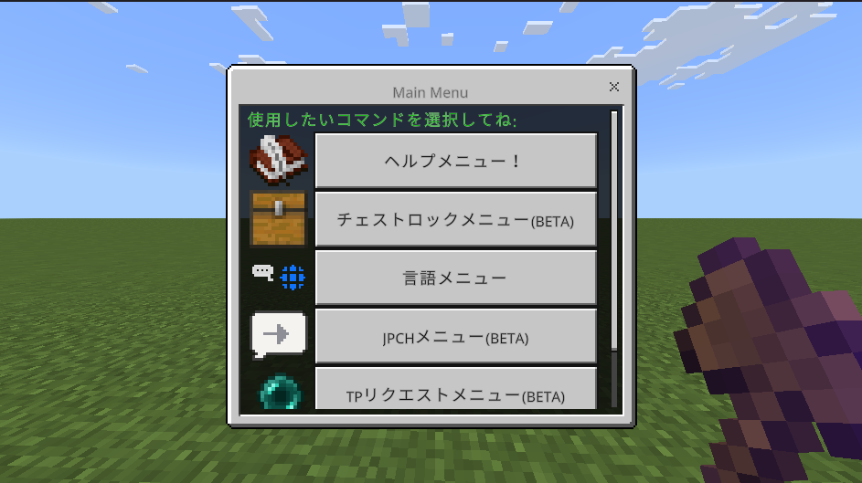

## Japanese Readme

[日本語の方はこちらをクリック👈](README.md)

## Download⬇️

[Download here👈](https://github.com/gamelist1990/ChestLockAddon/releases)

## Update.

**Version 0.9** This version adds new TPA commands and opens the UI with ItemUI.

**Updates**.
Added Database.ts to allow chest and Lang data to be completed in the database system.
Added Database.ts to allow chest and Lang data to be completed in the database system
Also, improved UI and reorganized other files

This GUI can be used with `!item` Or `!ui`. It just uses the `runCommand` function defined in [Handler.ts](devFolder/src/Modules/Handler.ts) (TP requests and language settings are now handled specifically I'm adding them)

## Overview

This code is an addon that allows you to run commands such as `!help`. Commands such as `!chest`, `!dev`, `!lang`, and `!ui` are also added, prefixed `! ` can be changed in `handler.ts`. Multilingual support is also available.

## Commands.

* **`!help`**: help command - displays a list of available commands.
* **`!chest`**: chest command - opens the chest command.
* **`!lang`**: Lang command - change language settings.
* **`!dev`**: developer only command - requires tag OP.
* **`!ui`**: ui command for ps4/5
* **`!jpch`**: need tag beta also experimental for LunaChat general version
**`!item`**: you can get an item to open the UI
**`!tpa`**: you can send TP requests
**`!list`**: display player information

* Other commands will be added in the future.

## Change prefix

You can change the prefix of commands in `handler.ts`.

## Multilingual support

This add-on supports multiple languages. Currently, the following languages are supported.

* **`ja_JP`**: Japanese
** **en_US`**: English
* **`zh_CN`**: Chinese (Simplified)
* **`ru_RU`**: Russian
* **`ko_KR`**: Korean
**`fi_FI`**: Finnish

**`!lang` command** can be used to change the language.

## How to use

Download the add-on from the release. 2.
Enable the `-beta` experimental feature in Minecraft. 3.
Join a world and use `!help` to see the list of commands.

## Misc.

The language folder is in src/command/langs/list
(define your translation key in json!)

Translated with DeepL.com (free version)