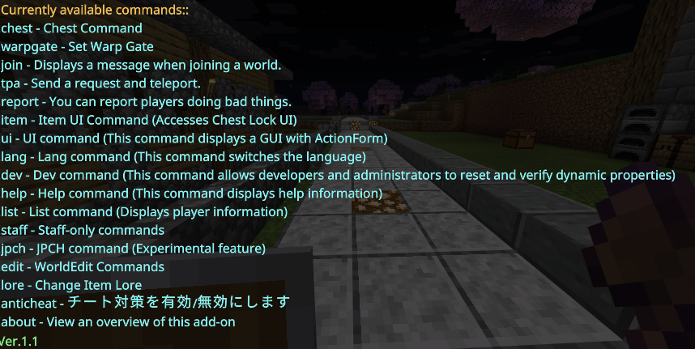

## Japanese Readme

[Click here for Japanese 👈](README.md)

## Download⬇️

[Download here👈](https://github.com/gamelist1990/ChestLockAddon/releases)

## Update

**Version 1.0** Many behind-the-scenes updates have been made. Please refer to the changelog below for details.
[ChangeLog](https://github.com/gamelist1990/ChestLockAddon/compare/0.9...1.0)

**Changes**
Detailed changes can be found in the ChangeLog above.

Here's a brief summary of the changes:

- Bug fixes and feature additions. Specifically:
- Added anti-cheat to packet.ts (custom anti-cheat)
- Organized files
- Players without appropriate permissions will no longer see `Dev`/`list`/`join`/`warpgate`/`edit`/`anticheat` when using the help command
- Several new commands have been added, check the command list below for details.

## Overview

This code is an addon that is used by executing commands like `!help`. It supports UI elements; use `!item` or `!ui` to access them. The prefix `!` can be changed in `handler.ts`. The addon also supports multiple languages.

If you encounter any bugs or issues, please feel free to report them on Discord or by creating an issue.

## Commands

* All commands for owners require the (OP) tag, so use `/tag @s add op`.
* **`!help`**: help command - displays a list of available commands.
* **`!chest`**: chest command - opens the chest command menu.
* **`!lang`**: Language command - changes the language setting.
* **`!dev`**: Developer command - (op)
* **`!ui`**: Added a UI command for PS4/5 users.
* **`!jpch`**: A feature that replicates LunaChat (experimental).
* **`!item`**:  Obtain an item that opens the UI.
* **`!tpa`**:  Send a teleport request.
* **`!list`**: Display player information (op).
* **`!anticheat`**:  Usage: on|off|freeze Player |unfreeze Player (op).
* **`!lore`**:  lore -set apple sets the description of the item you are holding. lore -rename test can also rename the item.
* **`!join`**:  This command uses the subcommand -settings to write rules. Use (-true/-false) to toggle display (op).
* **`!warpgate`**: This command creates warp gates. Usage: `!warpgate -create gate name TP destination coordinates`. To delete: `!warpgate -delete gate name`. To display the list: `-list`.
* **`!about`**:  Displays an overview of this addon.

* More commands will be added in the future.

## Changing the Prefix

The command prefix can be changed in `handler.ts`.

## Multilingual Support

This addon supports multiple languages. Currently supported languages are:

* **`ja_JP`**: Japanese (fully supported)
* **`en_US`**: English (fully supported)
* **`zh_CN`**: Chinese (Simplified) (partially supported)
* **`ru_RU`**: Russian (partially supported)
* **`ko_KR`**: Korean (partially supported)
* **`fi_FI`**: Finnish (partially supported)

Use the **`!lang` command** to change the language.

## How to Use

1. Download the addon from the releases page.
2. Enable the `-beta` experimental feature in Minecraft.
3. Join the world and use `!help` to view the list of commands.
4. If you are the world administrator, it is recommended to add the op tag.

## Others

The language folders are located in src/command/langs/list.
(Define the translation keys in the JSON files).