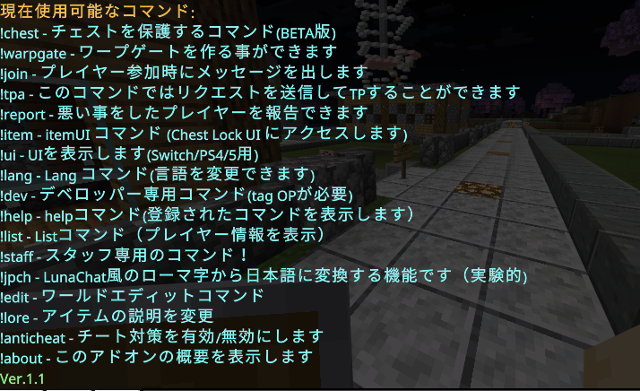

## English Readme

[Click here for English 👈](EN_README.md)

## Download⬇️

[ダウンロードはこちら👈](https://github.com/gamelist1990/ChestLockAddon/releases)

## Support

[Discord](https://discord.com/invite/GJyqBm7Pyd)

## Update

**Version 1.4**  新機能を追加しました
[ChangeLog](https://github.com/gamelist1990/ChestLockAddon/compare/1.3...1.4)

**更新点**
詳細な変更点は☝のChangeLogを見てね

ここでは簡潔に変更点をまとめます

- Version1.4に更新
- その他バグ修正
- ファイル整理及び翻訳キーの変更
- またPEX鯖作成時に使用したモジュールを追加
- 追記:もう少しで1.5-Betaを配布します**あくまでもBETA版です**

*

## 概要

このコードは、`!help` などのコマンドを実行して使用するアドオンです。一応UI等にサポートしています使う場合は`!item`もしくは`!ui`を使用してください、プレフィックス `!` は `handler.ts` で変更可能です。また多言語にも対応しています。

バグや何か問題点があれば気軽にDiscordもしはIssuseまでお願いします

## コマンド

* オーナー向けのコマンドは全て(OP)タグが必要なので`/tag @s add op `を付けてください
* **`!help`**:  helpコマンド - 利用可能なコマンド一覧を表示します。
* **`!chest`**:  chestコマンド - チェストコマンドを開きます
* **`!lang`**:  Lang コマンド - 言語設定を変更します。
* **`!dev`**:  デベロッパー専用コマンド -  (op)
* **`!ui`**:  ps4/5用にuiコマンドを追加しました
* **`!jpch`**: LunaChatを再現した機能です（実験中）
* **`!item`**: UIを開くアイテムをゲットできます
* **`!tpa`**: TPリクエストを送る事ができます
* **`!list`**: プレイヤーの情報を表示できます(op)
* **`!antichat`**:使用方法はon|off|freeze Player |unfreeze Player で使います(op)
* **`!lore`**: lore -set apple で手に持っているアイテムの説明を設定できますlore -rename testでアイテムの名前も変更できます
* **`!join`**: このコマンドはサブコマンドで-settingsを使用してルールを書けます(-true/-false)で表示の切り替え可能(op)
* **`!warpgate`**:このコマンドはワープゲートを作成できます使用方法は`!warpgate -create ゲート名 TP先の座標` /削除する場合は `!warpgate -delete ゲート名` /リスト表示は`-list`で可能です
* **`!about`**:このアドオンの概要を表示してくれます
* **`!staff`**:こスタッフ専用のコマンドです(タグ:staff必要)
* **`!report`**:悪い事をしているプレイヤーを報告できます
**1.1の際から更新されていません(1.5時点で更新します)**

* その他、コマンドは今後追加予定です。

## プレフィックスの変更

コマンドのプレフィックスは `handler.ts` で変更できます。

## 多言語対応

このアドオンは多言語に対応しています。現在対応している言語は以下の通りです。

* **`ja_JP`**: 日本語（完璧に対応）
* **`en_US`**: 英語（完璧に対応）
* **`zh_CN`**: 中国語 (簡体字) (一部未対応)
* **`ru_RU`**: ロシア語　(一部未対応)
* **`ko_KR`**: 韓国語　(一部未対応)
* **`fi_FI`**: フィンランド語　(一部未対応)

**`!lang` コマンド** を使用して言語を変更できます。

## 使用方法

1. リリースからアドオンをダウンロードしてください。
2. マインクラフトの実験機能の `-beta` を有効にしてください。
3. ワールドに参加し、`!help` でコマンド一覧を確認してください。
4. ワールドの管理者の場合タグopを付ける事をオススメします。

## その他

言語フォルダはsrc/command/langs/listにあります
(jsonに翻訳キーを定義してね)
